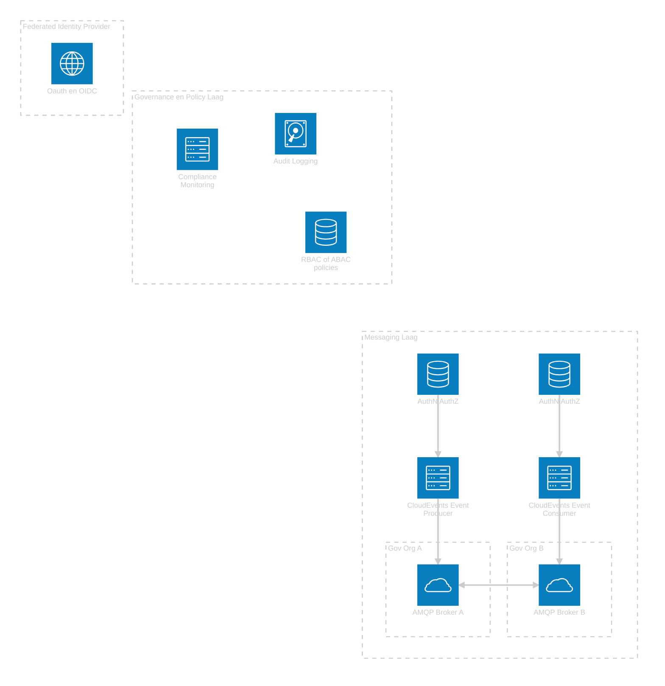

```mermaid
---
config:
  theme: neo-dark
  architecture-beta:
    htmlLabels: false
---
architecture-beta
    group not[Messaging Laag]
    group gova[Gov Org A] in not
    group govb[Gov Org B] in not

    group gov[Governance en Policy Laag]
    group id[Federated Identity Provider]

    service s1(cloud)[AMQP Broker A] in gova
    service s2(cloud)[AMQP Broker B] in govb
    service ce1(server)[CloudEvents Event Producer] in not
    service ce2(server)[CloudEvents Event Consumer] in not
    service a1(database)[AuthN AuthZ] in not
    service a2(database)[AuthN AuthZ] in not

    service g1(database)[RBAC of ABAC policies] in gov
    service g2(disk)[Audit Logging] in gov
    service g3(server)[Compliance Monitoring] in gov

    service i1(internet)[Oauth en OIDC] in id

    s1:R <--> L:s2
    ce1:B --> T:s1
    ce2:B --> T:s2
    a1:B --> T:ce1
    a2:B --> T:ce2
```
<figure id='messaging_laag'>
<figcaption>Voorbeeld van AMQP based messaging in FDS</figcaption>
</figure>
